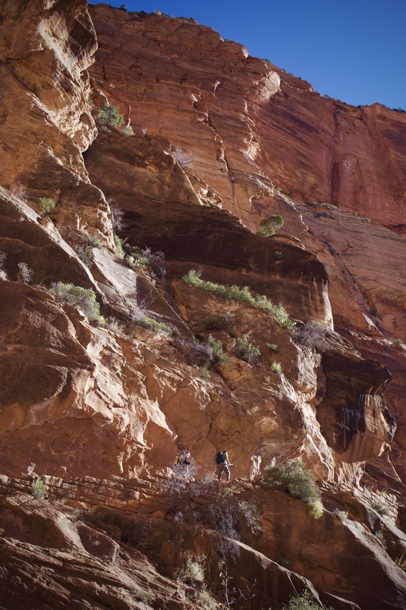

### Hello, I'm Huiyu! :)

I'm now living in Hawai'i for my hobby - surfing. I also love coding, surfing, and photography. 

Check out three of my shots!

<!-- <picture>
  <source media="(prefers-color-scheme: dark)" srcset="https://raw.githubusercontent.com/huiyuxie/huiyuxie/output/github-contribution-grid-snake-dark.svg">
  <source media="(prefers-color-scheme: light)" srcset="https://raw.githubusercontent.com/huiyuxie/huiyuxie/output/github-contribution-grid-snake.svg">
  
</picture> -->

| **Date**: December 15, 2023   **Location**: Zion National Park, Utah    | **Date**: August 16, 2023   **Location**: Makapuu Beach, Hawai'i    | **Date**: December 12, 2022   **Location**: Santa Clara University    |
|---|---|---|

<!--
**huiyuxie/huiyuxie** is a ✨ _special_ ✨ repository because its `README.md` (this file) appears on your GitHub profile.

Here are some ideas to get you started:

- 🔭 I’m currently working on ...
- 🌱 I’m currently learning ...
- 👯 I’m looking to collaborate on ...
- 🤔 I’m looking for help with ...
- 💬 Ask me about ...
- 📫 How to reach me: ...
- 😄 Pronouns: ...
- ⚡ Fun fact: ...
-->
